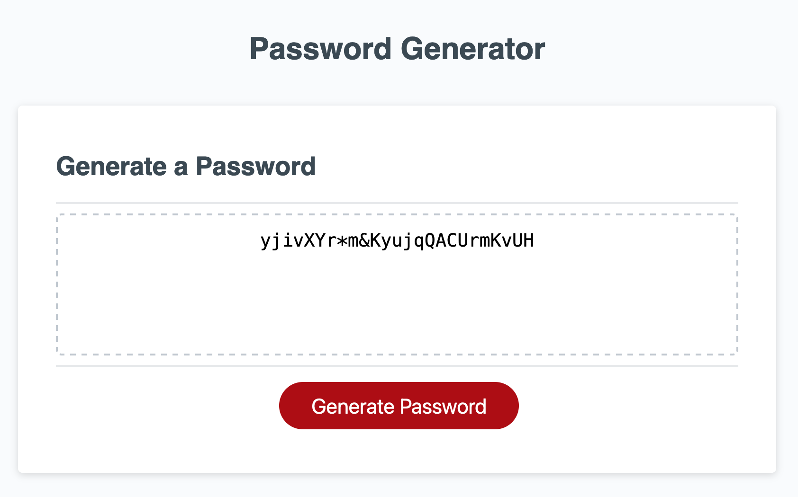

# pwgeneratorER

## Description
This project creates a password between 8 and 128 characters (based on user input) with some combination of uppercase, lowercase, special characters, and numbers based on user confirmation. It uses javascript's alert, confirm, and prompt functions to do so.

## Installation
Go to the deployed github application!

## Usage
Enter the number of characters (if invalid input is provided, an error message will show) and then click OK or cancel to allow or disallow each type of character as the alerts pop up. Some browsers offer a "stop showing alerts from this page" option - don't do this, or the app won't work!

If all directions are followed, the password should show up in the box like this:

## Credits
The starter code came from the course page. No other credits are necessary.

## License
No license applies.